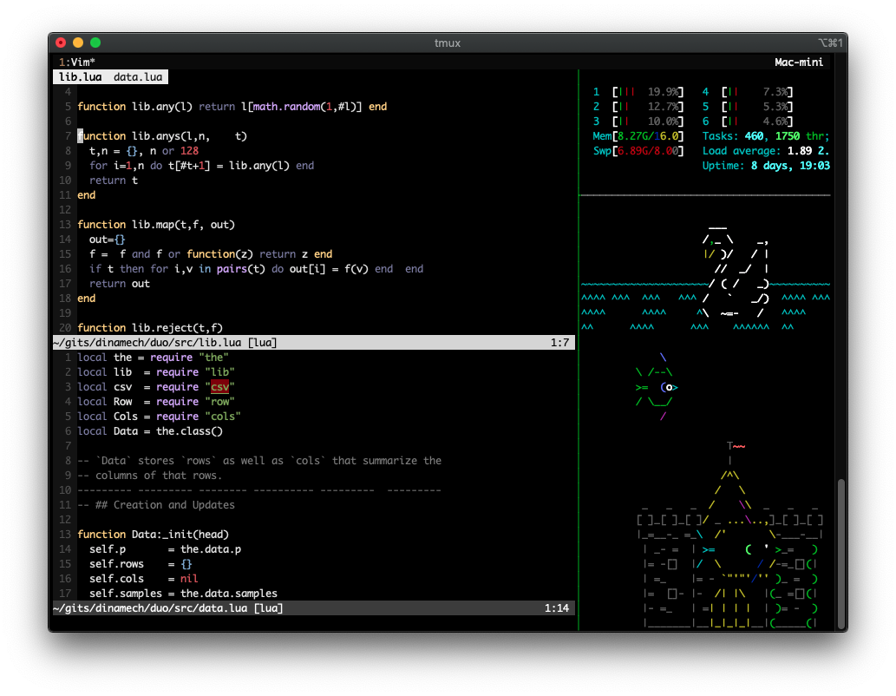

 
 

&nbsp;&nbsp;&nbsp;&nbsp; 
 

<a 
href="LICENSE.md">License</a> :: <a 
href="INSTALL.md">Install</a> :: <a
href="CODE_OF_CONDUCT.md">Contribute</a> :: <a 
href="CONTACT.md">Contact</a> 

# Sample lua code. 

Share and enjoy. For details, see [website](http://menzies.us/lua). 

This code shows all my lua triks.

When used, every soruce file `X.lua` can be tested used the code in `Xok.lua`.

Also, soooo many cool shell and editting tricks:

- Syntax highlights
- Tabs
- Git gtters
- and so much more

<a href="etc/img/screen-vim.png"> Click to zoom.</a> 

