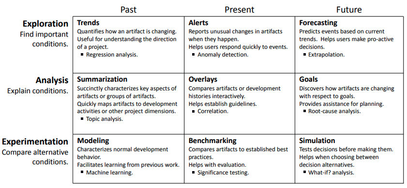
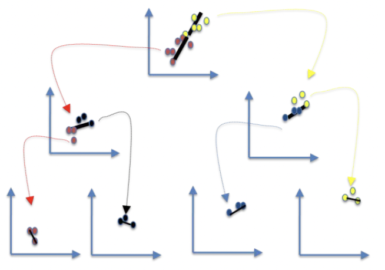

**[Docs](https://menzies.us/l5) • [Repo](https://github.com/timm/l5) • [Issues](https://github.com/timm/l5/issues) • [&copy;2022](http://github.com/timm/l5.LICENSE.md)** Tim Menzies

#  Do you understand AI?

Do you understand AI? Want to check if you do?

Alternatively, do you want to better understand AI?  Want to practice that skill, a little more?

If you answered "yes" to any of the above, there here's a little exercise for you.
Write down what you think an AI toolkit should do, then code
it up, very succinctly (say, in less than 1000 lines of code). And no cheating 
(so no importing of some massive background AI library).

For example, 
Buse and Zimmermann[^Bu12] surveyed over  hundreds of developers and managers to
find a list of "information needs" for software analytics. 
Lets make sure you understand these, enough, to code them succinctly.

(Aside: this list is not quite up-to-date- it makes no mention of current concerns about FAT (fair, accountable, trust) or bias mitigation.
Nor does it really touch on model-based reasoning  or multi-objective optimization. But that's ok-- we can add that i and still not break 1000 lines of code).

I use this exercise  to teach software engineers what goes on inside AI.
My premise is that
the AI-literate engineering should be able to mix and match AI tools
  to create specific solutions for specific problems.  
To show then what goes on inside the box,
I ask them to:

- Reproduce this code in whatever language they like (except the one used here). That takes 6-8 weeks.
- Find all the short-cuts in this code, then find other AI tools that another approach to those short-cuts.
- Benchmark this tiny toolkit against those more elaborate tools. This is end-of-semester project, which takes
  another 6-8 weeks.

## Why is all these coded in LUA?

- Because I want you to learn AI by coding it up from scratch, but I do not want to give you a fully worked solution.
So here's my code-- and your job is to recode it.
- Because Lua is fun to write and [easy to learn](https://learnxinyminutes.com/docs/lua/).
- Because
LUA
supports multiple programming methods, including procedural, object-oriented, functional, and data-driven programming. You can also use it to
write you own [domain-specific alnguages](https://www.lua.org/wshop11/luaws11_ag.pdf).
- Because LUA is great for teaching since 
it installs, very quickly, on most platforms. This means that 
this code can serve as an executable specification
that students can use to check the output of their own code.
- Also, for hyperparameter optimziation, LUA has an interesting special advantage
  - A LUA name space is a very simple, very regular thing.
If I load  a file twice (using `dofile`) then I get **two** copies of the namespace of that code. 
  - Which means I can write an optimizer in LUA
and use that optimizer to optimize itself (in another namespace) which almost no chance (\*)  of variables  in one space messing with the other

(\*) Of course, nothing is 100% safe. If one namespace reset the random number seed, that change can spread to the other space. Ditto with any other
global defined in the background LUA libraries.

 

    
The need for baselines. XXXX

Standard supervised learners assume that all examples have labels.
When this is not true, then we need tools to incrementally 
(a) summarize what has been seen so far; (b) find and focus
on the most interesting part of that summary, (c) collect
more data in that region, then (d) repeat.
         

To make that search manageable, it is useful to exploit a 
manifold assumption; i.e.
higher-dimensional data can be approximated in a lower dimensional
manifold without loss of signal[^Ch05] [^Le05].
Manifolds lead to _continuity_
effects; i.e. if there are fewer dimensions, then there are more
similarities between examples.
Continuity simplifies _clustering_
([and](and) any subsequent reasoning).  More similarities means  easier
clustering. And after clustering, reasoning just means reason about
a handful of examples (maybe even just one)  from each cluster.
        
**HOMEWORKS**

- **Scripting**: little languages (e.g. regular expressions); test-drive-development, CLI design, version control, GitHub workflows, test-driven development, open science
- Data layer: summarize text files as samples of data
- Anomaly detection: Nearest-neighbor, Clustering
- Validation: effect size, significance texts
- Semi-supervised learning
- Regression, model trees.
- Discretization, explanation
- Privacy
- Planning, monitoring
- Optimization
- Bias, Fairness mitigation

**ASSiGNMENTS**

- **Instance selection**: filter the data down to just a few samples per
cluster, the reason using just those.
- **Anomaly detection**
- **Explanation** 
Discretize the numeric ranges (\*) at each level of the recursion,
then divide the data according what range best selects for one half, or the other
at the data at this level of recursion.
- **Multi-objective optimization:** This code
can apply Zitzler's multi-objective ranking predicate[^Zit04] to prune the worst
half of the data, then recurs on the rest[^Ch18]. Assuming a large over-generation
of the initial population (to say, 10,000, examples), this can be just as effective
as genetic optimization[^Ch18], but runs much faster.
- **Semi-supervised learning**: these applications require only the _2.log(N)_ labels at
of the pair of furthest points seen at each level of recursion.
- **Privacy**
- **Planning**
- **Monitoring**

[^Ah91]: Aha, D.W., Kibler, D. & Albert, M.K. [Instance-based   learning algorithms](https://link.springer.com/content/pdf/10.1007%2FBF00153759.pdf). Mach Learn 6, 37–66 (1991).  https://doi.org/10.1007/BF00153759

[^Bo98]: Boley, D., 1998.  [Principal directions divisive partitioning](https://www-users.cse.umn.edu/~boley/publications/papers/PDDP.pdf) Data Mining and Knowledge Discovery, 2(4): 325-344.

[^Bu12]: Buse, R. and Zimmerman T. [Information Needs for Software Development Analytics](https://www.microsoft.com/en-us/research/wp-content/uploads/2016/02/MSR-TR-2011-8.pdf), ICSE'12, 2012

[^Ch05]: [Semi-Supervised Learning](http://www.molgen.mpg.de/3659531/MITPress--SemiSupervised-Learning) (2005) Olivier Chapelle,  Bernhard Schölkopf, and Alexander Zien (eds).  MIT Press.
 
[^Ch18]: [Sampling” as a Baseline Optimizer for Search-Based Software Engineering](https://arxiv.org/pdf/1608.07617.pdf), Jianfeng Chen; Vivek Nair; Rahul Krishna; Tim Menzies IEEE Trans SE, (45)6, 2019

[^Ch22]: [Can We Achieve Fairness Using Semi-Supervised Learning?](https://arxiv.org/pdf/2111.02038.pdf) (2022), Joymallya Chakraborty, Huy Tu, Suvodeep Majumder, Tim Menzies. 

[^Fal95]: Christos Faloutsos and King-Ip Lin. 1995. FastMap: a fast algorithm for indexing, data-mining and visualization of traditional and multimedia datasets. SIGMOD Rec. 24, 2 (May 1995), 163–174. DOI:https://doi.org/10.1145/568271.223812

[^Le05]: Levina, E., Bickel, P.J.: [Maximum likelihood estimation of intrinsic dimension](https://www.stat.berkeley.edu/~bickel/mldim.pdf).  In: Advances in neural information processing systems, pp. 777–784 (2005)

[^Ke92]: Kerber, Randy [ChiMerge: Discretization of Numeric Attributes](https://www.aaai.org/Papers/AAAI/1992/AAAI92-019.pdf), AAAI'92

[^Pl04]: Platt, John.  [FastMap, MetricMap, and Landmark MDS are all Nystrom Algorithms](https://www.microsoft.com/en-us/research/wp-content/uploads/2005/01/nystrom2.pdf) AISTATS (2005).

[^Zit04]: [Indicator-based selection in multiobjective search](https://link.springer.com/chapter/10.1007/978-3-540-30217-9_84) Eckart Zitzler , Simon Künzli Proc. 8th International Conference on Parallel Problem Solving from Nature (PPSN VIII
