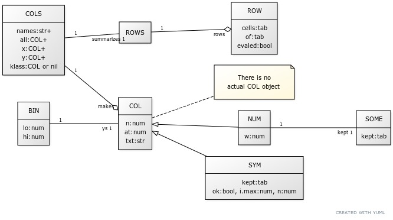

# [:high_brightness: SHORTr : less (but better) XAI](all.md)

<!-- a href="all.md"></a --->

AI and XAI (explainable artificial intelligence) need not be complicated.

For example, here we need just a few 100 lines of LUA to search
N items to  find and explain the best ones, using just log(N) evals. Along the way,
the object model we build could also be applied to  many other AI tasks (nearest neighbor,
decision trees, bayes classifiers, etc).

|       what | where                                                                                                                                                                                     |
|-----------:|-------------------------------------------------------------------------------------------------------------------------------------------------------------------------------------------|
| start here | [help](all.md) &hellip;  [install](/INSTALL.md) &hellip; [design notes](design.md)                                                                                                        |
|      build | [Makefile](https://github.com/timm/shortr/blob/master/etc/src/Makefile) (just for doco)                                                                                                   |
|      demos | [go](go.md)                                                                                                                                                                               |
|       apps | [nb](nb.md) &hellip; [tree](tree.md)                                                                                                                                                      |
|  functions | [lib](lib.md)                                                                                                                                                                             |
|    methods | [bin](bin.md) &hellip; [cols](cols.md) &hellip; [num](num.md) &hellip; [row](row.md)  [rows](rows.md) &hellip; [some](some.md) &hellip; [sym](sym.md) &hellip; [tree](tree.md) |

 

 

## Design notes : about our objects

One of the  theres here is that that there the thing we call "data 
mining" shares many of its internal data structures and algorithms
with the thing we call "optimization". So once we build those
internal things, then building "data miners" or "optimizers"
is a  pretty trivial extension. 

Just to demonstrate this, consider the object model of SHORTr:

 ***-   `[ROWS](rows.md#create)` holds many `[ROW](row.md#create)`s (and each `[ROW](row.md#create)` holds one record).  `[ROWS](rows.md#create)` summarize their numeric
or symbolic  columns in `[NUM](num.md#create)`s or `[SYM](sym.md#create)`s (respectively). Summaries are held in `[COLS](cols.md#create)`, divided into  (x,y) sets for
independent and dependent columns (respectively). 
- `[BIN](bin.md#create)`s and `[SOME](some.md#create)` are helper classes. Pairs of (x,y) columns are summarized in `[BIN](bin.md#create)`s. Adjacent `[BIN](bin.md#create)`s with  similar y distributions
are merged. 
`[SOME](some.md#create)` is a helper
for `[NUM](num.md#create)`s that holds just some sample of the numerics in that column. 
- Everything else is just tiny extensions to the above object model. e.g. 
  - When clustering, each cluster is its own `[ROWS](rows.md#create)`.
  - `[NB](nb.md#create)` classifiers create one `[ROWS](rows.md#create)` per class in the training data.
  - Decision `[TREE](tree.md#create)`s are built by recursively finding the `[BIN](bin.md#create)`s that best distinguish different `[ROW](row.md#create)`s. 
  - [XAI](xai.md#create)
  - etc.

## Design notes : about [XAI](xai.md#create)
From  [Wikipedia](`https`://en.wikipedia.org/wiki/Explainable_artificial_intelligence) :*** 
Explainable AI (XAI), or Interpretable AI, or Explainable Machine
Learning (XML), is artificial intelligence (AI) in which the
results of the solution can be understood by humans. It contrasts
with the concept of the "black box" in machine learning where even
its designers cannot explain why an AI arrived at a specific
decision. By refining the mental models of users of AI-powered
systems and dismantling their misconceptions, XAI promises to help
users perform more effectively. XAI may be an implementation of
the social right to explanation. XAI is relevant even if there
is no legal right or regulatory requirement—for example, XAI can
improve the user experience of a product or service by helping end
users trust that the AI is making good decisions. This way the aim
of XAI is to explain what has been done, what is done right now,
what will be done next and unveil the information the actions are
based on. These characteristics make it possible (i) to confirm
existing knowledge (ii) to challenge existing knowledge and (iii)
to generate new assumptions.

> Recent scholarship has suggested that the pursuit of explainability
in AI techniques should be considered a secondary goal to the pursuit
of AI's effectiveness, -- and that encouraging the exclusive
development of XAI may limit the functionality of AI more broadly.

In reply to the last para, I offer my own experience where the trade-off was not "explanation or performance". 
Rather, by exploring concepts of XAI I can actually make the while
system better, faster, easier to understand. 
People are clever, as Davenport and Beck remind us,
but they  have fixed and limited attention spans
which they  hoard and use sparingly.
Herbert Simon say that humans  use heuristic "short cuts" that let 
them satisfy the demands of their work, just enough
before rushing off to their next
task.
Once such short-cut is the "cue"; i.e. a small range
of some variable that most effects the outcome. Feature
extraction and weighting  is the process of finding
those cues. This code can be summarized as "the hunt
for 'cues'". 

(Another short-cut is sampling; i.e. don't look at 
everything, just a few things. There are many ways to
sample and this code exploits them allL random, 
reservoir, extreme)

From all that I have distilled all that down to the following XAI algorithm
for semi-supervised multi-objective optimization XAI, in just a few hundreds lines of code:
- PASS1 (guess): eval two distant items on multi-objective criteria.
       Prune everything nearest the worst one. Recurse on rest.
- PASS2 (guess again): do it again, using better items from first pass.
- PASS3 (explain): recursively discretize attributes on how well they
      distinguish the best and worst items (seen in second pass).

This means, from N items, I can find and explain the best ones, using just log(N) evals. And then I can report
(using a decision tree) what are the key factors that select for those better examples. 

 **References**:
- Thomas H. Davenport and John C. Beck. (2001). 
  [The Attention economy](https://ubiquity.acm.org/article.cfm?id=376626). 
  Ubiquity 2001, May (May 1 - May 31, 2001), 
- Gigerenzer, G. (2008). 
  [Why Heuristics Work](https://pure.mpg.de/rest/items/item_2100099/component/file_2100098/content).
  Perspectives on Psychological Science, 3(1), 20–29. 
- Vilone, Giulia & Longo, Luca. (2020). 
  [Explainable Artificial Intelligence: a Systematic Review](https://arxiv.org/pdf/2006.00093.pdf)
- Simon, Herbert A. (1956). 
  [Rational Choice and the Structure of the Environment](https://uk.sagepub.com/sites/default/files/upm-binaries/25239_Chater~Vol_1~Ch_03.pdf)
  Psychological Review. 63 (2): 129–138.- 

## But what about Deep Learning?
I've found that XAI can (sometimes) actually 
_replace_ other AI tools since, at least in the domains
I've explored, XAI tools can make better conclusions, 
faster, and those conclusions are explicable to people.

But not always. If you gave me 10,000 wavelets
from a signal processing package then of course I'd 
reach for a deep learner. So yes, sometimes I will abondon XAI if the domain
needs its. That said, 
if you wanted to _tune_ that deep
learner, then I'd still use this code since it
just runs a few what-of queries on the
most important parts of the data. Also, if someone needs an _explanaition_
of what the DL doing, then this code might be useful.

## Viva la revolución
img src="che.jpg" align=right width=600> ***This code is a protest of sorts against
 mash-ups and bloatware and all their associated 
 problems with maintainability and technical debt and security.
 Surely, by now, we have the experience to revisit past implementations and radically simplify `them`:

<b*** 
William of Ockham:
/b> ***</br*** 

em>"Non sunt multiplicanda entia sine necessitate"</em> ***<br*** 
(Entities are not to be multiplied without necessity)
p> ***<b*** 
Ada Lovelace:
/b> ***<br*** 

em>"One essential object is to choose that arrangement which shall tend to reduce to a minimum the time necessary for completing the calculation.”</em> ***<p*** 

b>Tony Hoare:</b> ***<br*** 

em>"Inside every large program is a small program struggling to get out."</em> ***<p*** 

b>Alan Perlis:</b>  ***<em*** 
"Simplicity does not precede complexity, but follows it."
/em> ***<p*** 

b>Dieter Rams:</b>  ***<em*** 
"Less, but better."
/em> ***So, ask yourself the following questions. Once you've done _it_, did you really understand _it_? Let's check.
Can you do _it_ better?
Can you now
write _it_ in fewer lines and do you know how to make _it_ run faster?
Can you see how _it_ is same/different to other things?
And can you use those similarities to do more things with  _it_?
Finally, can you teach _it_ quickly to newcomers?
    
**Role Models**: Here are some of the people that
inspire me to code less, but `better`:<br*** 
[Jack Diederich](https://www.youtube.com/watch?v=o9pEzgHorH0), [Hilary Mason](https://www.youtube.com/watch?v=l2btv0yUPNQ),
[Brian McFee](https://brianmcfee.net/papers/ismir2011_sptree.pdf),
[Brian Kernighan](https://www.oreilly.com/library/view/beautiful-code/9780596510046/ch01.html),
[Joel Grus](https://github.com/joelgrus/data-science-from-scratch).
p>
And, in this context, I must not forget the LISPers:  
([Peter Seibel](https://gigamonkeys.com/book/)
  ([Conrad Barski](https://doc.lagout.org/programmation/Lisp/Land%20of%20Lisp_%20Learn%20to%20Program%20in%20Lisp%2C%20One%20Game%20at%20a%20Time%20%5BBarski%202010-11-15%5D.pdf)
  ([Paul Graham](http://www.paulgraham.com/onlisp.html)
    ([Peter Norvig](http://norvig.com/lispy.html)
      ([Guy Steele](https://dspace.mit.edu/bitstream/handle/1721.1/5790/AIM-353.pdf?sequence=2&isAllowed=y)))))). 

