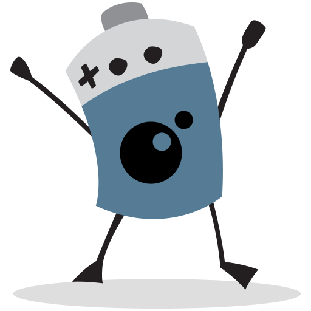

# B(Ai)ttery
LUA is a "batteries-not-included" language.
But LUA makes it easy to add in the  missing bits.
E.g. here are some "b(Ai)tteries" for XAI.

(c) 2022, Tim Menzies <timm@ieee.org>

|what          | where |
|:-------------|:------|
|**config**    | [all](all.html)   |
|**build**     | [Makefile](https://github.com/timm/shortr/blob/master/etc/src/Makefile) (just for doco)  | 
|**demos**     | [go](go.html)  |
|**apps**      | [nb](nb.html)  |
|**functions** | [lib](lib.html) |  
|**methods**   | [bin](bin.html) :: [cols](cols.html) :: [num](num.html) :: [row](row.html) :: [rows](rows.html) :: [some](some.html) :: [sym](sym.html) |

<a href=".."></a>
<a href=".."></a>
<a href="https://github.com/timm/shortr/actions/workflows/tests.yml"></a>
<a href="https://opensource.org/licenses/BSD-2-Clause"></a>
<a href="https://zenodo.org/badge/latestdoi/206205826"> </a> 


## Test suite


<details><summary></summary>

```lua
local all = require"all"
local chat,chunks,cli,csv = all.chat, all.chunks, all.cli, all.csv
local maps,on = all.maps, all.on
local settings,sort,splice, the = all.settings, all.sort, all.splice, all.the

local COLS,NUM, ROWS = require"COLS", require"NUM", require"ROWS"
local SOME, SYM, NB  = require"SOME", require"SYM", require"NB"
local ABCD           = require"ABCD"
```

</details>


To disable a test, rename it from `go` to `no`.


<details><summary></summary>

```lua
local go,no = {},{}
```

</details>


Print `the`.


<details><summary></summary>

```lua
function go.THE() chat(the); return true end
```

</details>


Sort some numbers.


<details><summary></summary>

```lua
function go.SORT() chat(sort{10,5,1,15,0}); return true end
```

</details>


Iterate over 2 lists


<details><summary></summary>

```lua
function go.MAPS() 
  chat(maps({1,2,3},{10,20,30}, 
       function(x,y) return x+y end)); return true end
```

</details>


 Summarize stream of numbers


<details><summary></summary>

```lua
function go.NUMS() 
  local n=NUM(); for i=1,1000 do n:add(i) end; chat(n)
  return true end
```

</details>


Keep a sample of 32 nums (out of 1000).


<details><summary></summary>

```lua
function go.SOME() 
  local s=SOME(32); for i=1,1000 do s:add(i) end
  chat(sort(s.kept)); return true end 
```

</details>


 Summarize stream of symbols


<details><summary></summary>

```lua
function go.SYM() 
  local s=SYM()
  for i=1,1000 do for _,c in pairs{"a","a","b"} do s:add(c) end end
  chat(sort(s.kept)); return true end 
```

</details>


Print CSV file.


<details><summary></summary>

```lua
function go.CSV() csv(the.file, chat); return true end
```

</details>


Try initializing some columns from a list of names.


<details><summary></summary>

```lua
function go.COLS() chat(COLS{"aa","Bb","Cc-"}.x); return true end
```

</details>


Load data from a csv file to a ROWS object.


<details><summary></summary>

```lua
function go.ROWS( rs) 
  rs=ROWS():fill(the.file)
  chat(rs.cols.x[1])
  chat(rs.cols.y); return true end
```

</details>


Print klass names


<details><summary></summary>

```lua
function go.KLASS() 
  local file = "../../data/diabetes.csv"
  local s=SYM()
  for _,row in pairs(ROWS():fill(file).rows) do s:add(row:klass()) end
  chat(s.kept)
  return true end
```

</details>


Load data from a csv file to a ROWS object.


<details><summary></summary>

```lua
function go.BETTERS( rs,best,m,rest) 
  rs=ROWS():fill(the.file)
  sort(rs.rows) 
  m    = (#rs.rows)^.5
  best = splice(rs.rows,1,m)  --(m^.5)) 
  rest = splice(rs.rows,1,#rs.rows - m) --#rs.rows - 30) --(m^.5)) 
  chat(rs:clone(best):mids())
  chat(rs:clone(rest):mids())
  return true end

function go.DIABETES(f,  a,n) --   i,t,a) 
  a = ABCD()
  n= NB(f or "../../data/diabetes.csv",function(got,want) a:add(got,want) end)
  for _,row in pairs(n.overall.rows) do print(row._eden._id) end
  --a:pretty( a:report() )
  return true end

function go.SOYBEAN()  
  go.DIABETES("../../data/soybean.csv") 
  return true end

function go.CHUNKS()
  chunks(the.file); return true end
-------
```

</details>


### Start


<details><summary></summary>

```lua
the = cli(the)
on(the, go)
```

</details>


