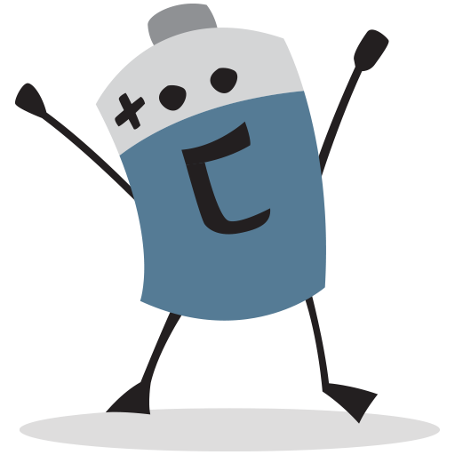

# [:high_brightness: B(Ai).Tery](all.md)

<a href="all.md"></a>

LUA is a "batteries-not-included" language.   But LUA makes it easy to add in the missing bits.
E.g. here is "Tery" which are my  "b(Ai)tteries" for XAI (explainable artificial intelligence).   


|       what | where                                                                                                         |
|-----------:|---------------------------------------------------------------------------------------------------------------|
| start here | [design notes](design.md) [help](all.md)     |                                                                 |
|      build | [Makefile](https://github.com/timm/shortr/blob/master/etc/src/Makefile) (just for doco)                       |
|      demos | [go](go.md)                                                                                                   |
|       apps | [nb](nb.md), [tree](tree.md)                                                                                  |
|  functions | [lib](lib.md)                                                                                                 |
|    methods | [bin](bin.md), [cols](cols.md), [num](num.md), [row](row.md), [rows](rows.md), [some](some.md), [sym](sym.md), [tree](tree.md) |

<br clear=all>
<p align=center>
<a href=".."></a>
<a href=".."></a>
<a href="https://github.com/timm/shortr/actions/workflows/tests.yml"></a>
<a href="https://opensource.org/licenses/BSD-2-Clause"></a>
<a href="https://zenodo.org/badge/latestdoi/206205826"> </a> 
</p>

## hold 1 record
See also [ROWS](rows.html) that holds multiple records.  
And [NUM](num.html) and [SYM](sym.html) that summarize the 
columns of the records.


```lua
local all = require"all"
local big,chat,lt,map  = all.big, all.chat, all.lt, all.map
local obj,rnds,sort    = all.obj, all.rnds, all.sort

--> ROW(of:ROWS, cells:tab) :ROW -> Place to store one record
```


(and stats on how it is used; e.g. `i.evaled=true` if we touch the y values.


```lua
local ROW = obj("ROW", function(i,of,cells) 
  i._of,i.cells,i.evaled = of,cells,false end)

--> i:ROW - j:ROW -> return distance between `i` and `j`
function ROW.__sub(i,j) 
  local d, cols = 0, i._of.cols.x
  for _,col in pairs(cols) do
    local inc = col:dist(i.cells[col.at], j.cells[col.at]) 
    d         = d + inc^the.p end
  return (d / #cols) ^ (1/the.p) end

--> around(i:ROW, rows:?[ROW]):tab ->  return rows in this table
```


sorted by distance to `i`. `rows` defaults to the rows of this ROWS.


```lua
function ROW.around(i, rows)
  local function rowGap(j) return {row=j, gap=i - j} end
  return sort(map(rows or i._of.rows, rowGap), lt"gap") end

--> better(i:ROW, j:ROW):boolean -> should `i` proceed before `j`?
function ROW.__lt(i,j)
  i.evaled, j.evaled = true, true
  local s1, s2, ys = 0, 0, i._of.cols.y
  for _,col in pairs(ys) do
    local x,y =  i.cells[col.at], j.cells[col.at]
    x,y = col:norm(x), col:norm(y)
    s1  = s1 - 2.7183^(col.w * (x-y)/#ys)
    s2  = s2 - 2.7183^(col.w * (y-x)/#ys) end
  return s1/#ys < s2/#ys  end

--> far(i:ROW,rows:?[ROW]):ROW -> find something `far` away.
function ROW.far(i,rows) return per(Row.around(i,rows), the.Far).row end

--> klass(i:ROW):any -> Return the class value of this record.
function ROW.klass(i) return i.cells[i._of.cols.klass.at] end

return ROW
```


