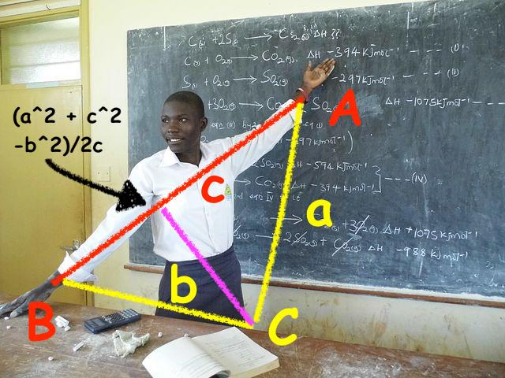

<a href="https://github.com/timm/shortr/actions/workflows/tests.yml"></a>
<a href=".."></a>
<a href="https://opensource.org/licenses/BSD-2-Clause"></a>
<a href="https://zenodo.org/badge/latestdoi/206205826"> </a> 

# [:high_brightness: SHORTr : less (but better) XAI](oo.md)
 a
AI and XAI (explainable artificial intelligence) need not be hard. 
E.g. here's a few hundred lines of LUA to search N items to find and 
explain the best ones, using just log(N) evals.

This code starts with a help string (from which we extract our global settings)
and ends with a library of demos (see the `go` functions at end of file).  
- Each setting can be (optionally) updated by a command-line flag.
- Demos can be run separately or  all at once (using `-g all`).
  To handle regression tests, we report back to the operating system 
  the failures seen when the demos run.

This code uses the following classes.
- ROWS hold many ROWs which are summarized in COLs.
- COLs can be either SYMbolic or NUMeric). 
- Two helper classes are:
  - SOME: keeps a sample of data from a NUMeric column.
  - BIN:  tracks what goal variables are seen within some range.

Data from disk is read into a ROWS, from which we 
do some clustering (and each cluster is new ROWS object, containing a subset
of the data). A decision tree is built that reports the difference between the 
better and worst classes (and that tree is nothing but tree of ROWS with a `kids` pointer
to sub-ROWS).

More technically, using the independent variables, we do recursive random projections using 
[FASTMAP](https://www.ijcai.org/Proceedings/2018/0198.pdf#page=2) and [Aha's heterogeneous 
distance measures](https://link.springer.com/content/pdf/10.1007/BF00153759.pdf#page=6). 
At each level of the recursion, pairs of
remote points are ranked (using the dependent variables) and all
the data associated with the best/worst points are labeled `bests`
or `rests`.  Supervised discretization and an entropy-based
decision tree is then used to distinguish the best `bests` from
the worst `rests`. Note that all this access the dependent variables just _log2(N)_ times.


|Category|Class|Protocol|What|Notes|
|:---------|:----|:--------|:---|:----|
|Config |  |  | [***help  :str***](#1)|Help text for this code.|
| |  |  | [***the  :table***](#2)|Config settings. Extracted from `help`. e.g. `the.cohen=.35`.|
| |  |  | [***cli(the :tab) :tab***](#3)|Updates settings from the command line.|
|Names |  |  | [***obj(txt :str,base :?class)  :class***](#4)|Make a class, perhaps as a kid of `base`.|
|Columns | COL | Create | [***COL(at?int=0, txt :?str="") : COL***](#5)|Superclass constructor for columns.|
| |  |  | [***clone()  :COL --> Return some of the same structure.***](#6)||
| |  | Query | [***dist(x :any, y :any)  :num***](#7)|Return distance. For missing values, assume max distance.|
| |  | Update | [***add(x :any, inc :?int=1)***](#8)|`inc` times repeat: add `x`|
| | SOME | Create | [***SOME(at?int=0, txt :?str="") : SOME***](#9)|Constructor.|
| |  | Update | [***add(x :num)***](#10)|If full then at odds `self.some/self.n`, keep `x`(replacing some older item, at random). Otherwise, just add.|
| |  | Query | [***has(i :SOME) :tab***](#11)|Ensure contents are sorted. Return those contents.|
| | NUM | Create | [***NUM(at :?num=0, txt :?str="")  :NUM***](#12)|Constructor.|
| |  | Discretize | [***bin(x :any)***](#13)|Return `x` mapped to a finite number of bins|
| |  |  | [***merge(j :NUM)  :NUM***](#14)|combine `self` with `j`.|
| |  |  | [***merges(t :[BIN])  :[BIN]***](#15)|merge a list of BINs (for numeric y-values)|
| |  | Distance | [***dist(x :num,y :num) : num***](#16)|Return distance 0..1 between `x,y`.|
| |  | Likelihood | [***like(x :any)***](#17)|Return the likelihood that `x` belongs to `i`. <|
| |  | Query | [***div(i :NUM)  :tab***](#18)|Return `div`ersity of a column (tendency to depart central tendency).|
| |  |  | [***mid(i :NUM))  :tab***](#19)|Return a columns' `mid`ddle|
| |  |  | [***norm(i :NUM, x :num)  :num***](#20)|Normalize `x` 0..1 for lo..hi|
| |  | Update | [***add(i :NUM, x :num, n :?int=1)***](#21)|`n` times,update `i`'s SOME object.|
| | SYM |  | [***SYM(at :?int=0, txt :?str="")  :SYM***](#22)|Constructor.|
| |  | Discretize | [***bin(x :any)***](#23)|Return `x` mapped to a finite range (just return x).|
| |  |  | [***merge(j :SYM) :SYM***](#24)|Combine self with `j`.|
| |  |  | [***merges(i :SYM,t :tab) :tab***](#25)|Merge a list of bins (for symbolic y-values).|
| |  | Distance | [***dist(x :any,y :any)  :num***](#26)|Return distance 0..1 between `x,y`.|
| |  | Likelihood | [***like(x :any,prior :num)  :num***](#27)|Return how much `x` might belong to `i`.|
| |  | Report | [***div() :tab***](#28)|Return `div`ersity of a column (its entropy).|
| |  |  | [***mid() :num***](#29)|Return the most common symbol (the `mid`ddle (central tendency).|
| |  | Update | [***add(x :any, n :?int=1)***](#30)|Add `n` count to `self.kept[n]`.|
|Data | ROW | Create | [***ROW(of : ROWS, cells :tab)***](#31)|Constructor|
| |  | Query | [***better(j :ROW) :boolean***](#32)|should `self` proceed before `j`?|
| |  |  | [***klass(i :ROW) :any***](#33)|Return the class value of this record.|
| |  | Distance | [***i :ROW - j :ROW***](#34)|return distance between `i` and `j`|
| |  |  | [***around(rows :?[ROW]) :tab***](#35)|return rows in this table|
| |  |  | [***far(i :ROW,rows :?[ROW]) :ROW***](#36)|find something `far` away.|
| | COLS | Creation | [***is.PRED(x :str) :boll***](#37)|Return true if `x` satisfies `PRED`.|
| | Update |  | [***add(row :ROW)***](#38)|Update columns using data from `row`.|
| | ROWS | Create | [***ROWS(names :?[str], rows :?[ROW})  :ROWS***](#39)|Place to store many ROWS|
| |  |  | [***clone(init :?[ROW])  :ROWS***](#40)|Return a ROWS with same structure as `self`.|
| |  |  | [***fill(i :ROWS : src :(str|tab)) :ROWS***](#41)|copy the data from `src` into `self`.|
| |  | Likelihood | [***like(row;ROW,nklasses :num,nrows :num) :num***](#42)|Return P(H)*&prod;<sub>j</sub> (P(E<sub>j</sub>|H)).|
| |  | Cluster | [***best(rows :[ROW], stop :?num, rests :?tab={})  :[ROW]***](#43)|Recursively select best half.|
| |  |  | [***half(rows :[ROW], stop :?num, rests :?tab={})  :[ROW]***](#44)|Recursively select best half.|
| |  | Report | [***mids(p :?int=2,cols=?[COL]=i.cols.y) :tab***](#45)|Return `mid` of columns rounded to `p` places.|
|MISC | Lib | Lint | [***rogues()***](#46)|Warn if our code introduced a rogue global.|
| |  | Lists | [***kap(t :tab,f :fun) :tab***](#47)|Filter key,values through `fun`. Remove slots where `fun` returns nil|
| |  |  | [***map(t :tab,f :fun) :tab***](#48)|Filter through `fun`. Remove slots where `fun` returns nil|
| |  |  | [***per(t :tab,p :float) :any***](#49)|Returns the items `p`-th way through `t`.|
| |  |  | [***any(a :tab) :any***](#50)|Return any item, picked at random.|
| |  |  | [***many(a :tab,n :number) :any***](#51)|Return any `n`' items, picked at random.|
| |  | Maths | [***big :num***](#52)|Return `math.huge`|
| |  |  | [***R(n :?num=1)***](#53)|If `n` missing return a random number 0..1. Else return 1..`n`.|
| |  |  | [***rnd(num, places :int) :num***](#54)|Return `x` rounded to some number of `place`  &#9312; . <|
| |  | Sorting | [***gt(x :str) :function***](#55)|Returns functions that sorts increasing on `x`.|
| |  |  | [***lt(x :str) :function***](#56)|Returns functions that sorts decreasing on `x`.|
| |  |  | [***sort(t :tab,f :fun) :tab***](#57)|Sort list in place. Return list. `fun` defaults to `<`.|
| |  | Other | [***ako(x) :tab***](#58)|Return arg's metatable.|
| |  |  | [***same(x) :x***](#59)|Return arg, un changed.|
| |  | String2things | [***csv(file :str,  fun :fun) :tab***](#60)|Call `fun` with lines, split on ",".|
| |  |  | [***lines(file :str,  fun :fun) :tab***](#61)|Call `fun` with lines.|
| |  |  | [***words(s :str, sep :str, fun :fun) :tab***](#62)|Return `t` filled with `s`, split  on `sep`.|
| |  | Thing2string | [***chat(t :tab)***](#63)|Print table (as string). Return `t`.|
| |  |  | [***cat(t :tab) :str***](#64)|Return table as string. For key-indexed lists, show keys (sorted).|
| |  |  | [***fmt(s :str,...)  :str***](#65)|Emulate printf.|
| | Testing |  | [***go.all()***](#66)|Runs all the tests (called from command-line by `-g all`).|
| | Start |  | [***main()***](#67)|Start code.|


## Config
> ***help  :str***<a id=1></a><br>Help text for this code. 


```lua
local help = [[

SHORTr: semi-supervised multi-objective optimization XAI
(c) 2022 Tim Menzies <timm@ieee.org> BSD2 license
     
From N items, find and explain the best ones, using just log(N) evals.
PASS1 (guess): eval two distant items on multi-objective criteria.
      Prune everything nearest the worst one. Recurse on rest.  
PASS2 (guess again): do it again, using better items from first pass.  
PASS3 (explain): recursively discretize attributes on how well they
      distinguish the best and worst items (seen in second pass).
   
USAGE:
  lua shortr.lua [OPTIONS]
   
OPTIONS:
  -M  Min    min size of space                    =  .5
  -b  bins   max number of bins                   =  16
  -F  Far    how far to look for remove points    =  .95
  -k  k      Bayes hack: low attribute frequency  =  2
  -m  m      Bayes hack: low class frequency      =  1
  -p  p      distance coefficient (2=Euclidean)   =  2
  -s  seed   random number seed                   =  10019
  -S  Some   max number of nums to keep           =  256
  -w  wait   wait this number before testing      =  10
   
OPTIONS (other):
  -f  file   file           = ../../data/auto93.csv
  -g  go     start-up goal  = nothing
  -h  help   show help      = false ]]

```

> ***the  :table***<a id=2></a><br>Config settings. Extracted from `help`. e.g. `the.cohen=.35`. 


```lua
local the={}
local function thing(x) 
  x = x:match"^%s*(.-)%s*$"
  if x=="true" then return true elseif x=="false" then return false end
  return math.tointeger(x) or tonumber(x) or x end 

help:gsub("\n[%s]+[-]%S[%s]+([%S]+)[^\n]+=[%s]*([%S]+)",function(k,x) the[k]=thing(x) end)

```

> ***cli(the :tab) :tab***<a id=3></a><br>Updates settings from the command line. 

e.g. `-c .2` -- updates `the.cohen`. To flip booleans, just mention them 
on the command line; e.g. `-h` will flip `the.help=false` to `the.help=true`.

```lua
local function cli(t)
  for key,x in pairs(t) do 
    x = tostring(x)
    for n,flag in ipairs(arg) do 
      if   flag=="-"..key:sub(1,1) 
      then x = x=="false" and "true" or x=="true" and "false" or arg[n+1] end end
    t[key] = thing(x) end 
  return t end

```

## Names

`b4` is a list of names known before this code. Used by `rogue()` (see below)

```lua
local b4={}; for k,v in pairs(_ENV) do b4[k]=k end
```

By defining names before the code, the code can be written in any order.

```lua
local ako,any,big,cat,chat,csv,fmt,gt,isa,kap,lines,lt,main,many,map
local new,obj,per,push,R,rogues,rnds,same,sort,trim,words

```

> ***obj(txt :str,base :?class)  :class***<a id=4></a><br>Make a class, perhaps as a kid of `base`. 

Identity, methods, inheritance, polymorphism, encapsulation, all in 8 lines :-).

Instances have a unique `id` and use the `cat` function for pretty printing.
Every class must have a `CLASS:new()` function. 
Also, inheritance is implemented by copying over the parent methods
(so the parent has to be fully implemented before calling `obj`).

```lua
local _id=0
function obj(txt,base,  t,new,i)
  function new(k,...) 
    _id=_id+1; i=setmetatable({_id=_id},k); k.new(i,...); return i end
  t={__tostring=cat,super=base}
  for k,v in pairs(base or {}) do t[k] = v end
  t.is, t.__index =  txt, t
	return setmetatable(t,{__call=new}) end

```

## Columns
### COL
Superclass of NUM and SYM. 

**RESPONSIBILITIES** : 
- Create or clone a duplicate structure 
- Discretize values into a few bins (for building trees)
- Distance calculations (for clustering)
- Likelihood calculations (for Bayes)
- Query  central tendency and diversity and other things
- Update summarization
#### Create
> ***COL(at?int=0, txt :?str="") : COL***<a id=5></a><br>Superclass constructor for columns. 


```lua
local COL=obj"COL"
function COL:new(at,txt)
  self.at  = at or 0     
  self.txt = txt or ""  
  self.n   = 0 end     

```

> ***clone()  :COL --> Return some of the same structure.***<a id=6></a><br> 


```lua
function COL:clone()
  return ako(self)(self.at, self.txt) end

```

#### Query
> ***dist(x :any, y :any)  :num***<a id=7></a><br>Return distance. For missing values, assume max distance. 


```lua
function COL:dist(x,y)
  return x=="?" and y=="?" and 1 or self:dist1(x,y) end

```

#### Update
> ***add(x :any, inc :?int=1)***<a id=8></a><br>`inc` times repeat: add `x` 


```lua
function COL:add(x,inc)
  if x ~= "?" then 
    inc = inc or 1
    self.n = self.n + inc
    self:add1(x,inc) end end

```

### SOME
Given a finite buffer  
some small size `max`, then after reading 
a very large set of `n` numbers, we should only be keeping `max/n` of those nums.
#### Create
> ***SOME(at?int=0, txt :?str="") : SOME***<a id=9></a><br>Constructor. 


```lua
local SOME=obj("SOME",COL)
function SOME:new(...)
  self.super.new(self, ...)
  self.kept, self.ok, self.max = {}, true, the.Some end

```

#### Update
> ***add(x :num)***<a id=10></a><br>If full then at odds `self.some/self.n`, keep `x`(replacing some older item, at random). Otherwise, just add. 


```lua
function SOME:add1(x,inc)
  for j=1,inc do
    local a= self.kept
    if     #a  < self.max        then self.ok=false; push(a,x) 
    elseif R() < self.max/self.n then self.ok=false; a[R(#a)]=x end end end 

```

#### Query
> ***has(i :SOME) :tab***<a id=11></a><br>Ensure contents are sorted. Return those contents. 


```lua
function SOME:has()
  self.kept = self.ok and self.kept or sort(self.kept)
  self.ok=true
  return self.kept  end

```

### NUM
Summarize a sequence of numbers.


**RESPONSIBILITIES** : 
- Same as COL and knows if we want to minimize or maximize these values (see `w`).

**COLLOBERATIONS** : 
- Uses SOME to keep a sample of the data seen.

#### Create
> ***NUM(at :?num=0, txt :?str="")  :NUM***<a id=12></a><br>Constructor. 

Q: Where we use the `w` weight?  
A: See the `better` method inside [ROW](row.md) where `w` is used to 
   weight the dependent variables. In that code, one ROW is better than another
   when that weight rewards changing to that value.

```lua
local NUM=obj("NUM",COL)
function NUM:new(...)
  self.super.new(self, ...)
  self.kept = SOME()          
  self.w = self.txt:find"-$" and -1 or 1 end

```

#### Discretize
To discretize a numeric column, first map all the numbers into a finite number
of bins (say, divided on "(hi-lo)/16"). Then look at the class distrubutions
in each bin. While two adjacent bins have similar distributions, then merge them
and go look for anything else that might be merged. 

Q: For that to work, don't you need to to collect information on _two_ columns.
   (one you are trying to discretize and another holding the class distribution)?   
A:  Yes indeed. The class [BIN](bin.md) does that. Here, we define some services to help
[BIN](bin.md) do its work.

> ***bin(x :any)***<a id=13></a><br>Return `x` mapped to a finite number of bins 


```lua
function NUM:bin(x)
  local a = self.kept:has()
  local b = (a[#a] - a[1])/the.bins
  return a[#a]==a[1] and 1 or math.floor(x/b+.5)*b end

```

> ***merge(j :NUM)  :NUM***<a id=14></a><br>combine `self` with `j`. 


```lua
function NUM:merge(j,     k)
  k = self:clone()
  for _,some in pairs{self.kept, j.kept} do
    for _,x in pairs(some.kept) do k:add(x) end end
  return k end

```

> ***merges(t :[BIN])  :[BIN]***<a id=15></a><br>merge a list of BINs (for numeric y-values) 

Note the last line of `merges`: if anything merged, then loop again looking for other merges.
Else, time to finish up (expand the bins to cover all gaps across the number line).
FYI, to see what happens when this code calls `merged`, goto [BIN](bin.md).

Q: why is this defined here (and not in the BIN class)?  
A: The `merges` of several
BINs is different for NUMs and SYMs (in SYMs, we can't merge anything so `merges` just 
returns the original list, unchanged).

```lua
function NUM:merges(b4, min) 
  local function fillInTheGaps(bins)
    bins[1].lo, bins[#bins].hi = -big, big
    if #bins>1 then
      for n=2,#bins do bins[n].lo = bins[n-1].hi end end
    return bins 
  end ------------- 
  local n,now = 1,{}
  while n <= #b4 do
    local merged= n<#b4 and b4[n]:merged(b4[n+1],min) --"merged" defined in bin.md
    now[#now+1] = merged or b4[n]
    n           = n + (merged and 2 or 1)  -- if merged, skip passed the merged bin
  end
  return #now < #b4 and self:merges(now,min) or fillInTheGaps(now) end

```

#### Distance
> ***dist(x :num,y :num) : num***<a id=16></a><br>Return distance 0..1 between `x,y`. 

This code assume max distance for missing values.

```lua
function NUM:dist(x,y)
  if x=="?" and y=="?" then return 1 end
  if     x=="?" then y = self:norm(y); x = y<.5 and 1 or 0 
  elseif y=="?" then x = self:norm(x); y = x<.5 and 1 or 0
  else   x,y = self:norm(x), self:norm(y) end
  return math.abs(x - y) end 

```

#### Likelihood
> ***like(x :any)***<a id=17></a><br>Return the likelihood that `x` belongs to `i`. < 


```lua
function NUM:like(x,...)
  local sd,mu=self:div(), self:mid()
  if sd==0 then return x==mu and 1 or 1/big end
  return math.exp(-.5*((x - mu)/sd)^2) / (sd*((2*math.pi)^0.5)) end  

```

#### Query
> ***div(i :NUM)  :tab***<a id=18></a><br>Return `div`ersity of a column (tendency to depart central tendency). 


 

Q: In the code for `div`, where does the magic number 2.56 come from?   
A: Intuitively, the diversity can be measured by (a) ignoring outliers from, say, the top
and bottom 10% then (b) reporting the high-low values of the rest, perhaps divided by two
(since we reporting divergence from some middle point). 
But with a little bit of mathemagic, we can turn that (90th-10th)/2 report into some more
standard.
Recall that &pm;1 to &pm;2 sds covers 68 to 95% of the Gaussian prob.
In between, at &pm;1.28, we cover 90%. So (p90-p10)/(2*1.28) returns one sd. 

TL;DR, to make statisticians happy, do not
divide by 2, but 2*1.28 = 2.56.

```lua
function NUM:div() 
  local a=self.kept:has(); return (per(a,.9) - per(a,.1))/2.56 end

```

> ***mid(i :NUM))  :tab***<a id=19></a><br>Return a columns' `mid`ddle 


```lua
function NUM:mid() 
  local a=self.kept:has(); return per(a,.5) end

```

> ***norm(i :NUM, x :num)  :num***<a id=20></a><br>Normalize `x` 0..1 for lo..hi 


```lua
function NUM:norm(x)
  local a = self.kept:has()
  return (a[#a]-a[1])<1E-9 or (x-a[1])/(a[#a]-a[1]) end

```

#### Update
> ***add(i :NUM, x :num, n :?int=1)***<a id=21></a><br>`n` times,update `i`'s SOME object. 


```lua
function NUM:add1(x,inc)
  for j=1,inc do self.kept:add(x) end end 

```

### SYM
Summarize a sequence of symbols.


**RESPONSIBILITIES** : 
- Same as COL.

> ***SYM(at :?int=0, txt :?str="")  :SYM***<a id=22></a><br>Constructor. 


```lua
local SYM = obj("SYM",COL)
function SYM:new(...)
  self.super.new(self,...)
  slf.kept = {} end

```

#### Discretize   
> ***bin(x :any)***<a id=23></a><br>Return `x` mapped to a finite range (just return x). 


```lua
function SYM:bin(x) return x end

```

> ***merge(j :SYM) :SYM***<a id=24></a><br>Combine self with `j`. 


```lua
function SYM:merge(j,     k)
  k = self:clone()
  for _,kept in pairs{self.kept, self.kept} do
    for x,n in pairs(kept) do k:add(x,n) end end
  return k end

```

> ***merges(i :SYM,t :tab) :tab***<a id=25></a><br>Merge a list of bins (for symbolic y-values). 


```lua
function SYM:merges(t,...) return t end

```

#### Distance
> ***dist(x :any,y :any)  :num***<a id=26></a><br>Return distance 0..1 between `x,y`. 

Assume max distance for missing values.

```lua
function SYM:dist(x,y)
  return  (x=="?" or y=="?")  and 1 or x==y and 0 or 1 end

```

#### Likelihood  
> ***like(x :any,prior :num)  :num***<a id=27></a><br>Return how much `x` might belong to `i`. 


```lua
function SYM:ike(x,prior)
   return ((self.kept[x] or 0)+the.m*prior) / (self.n+the.m) end

```

#### Report
> ***div() :tab***<a id=28></a><br>Return `div`ersity of a column (its entropy). 

FYI, diversity is the  tendency _not_ to be at the central tendency.

```lua
function SYM:div()
  local ent, fun = 0, function(p) return -p*math.log(p,2) end
  for x,n in pairs(self.kept) do if n > 0 then ent=ent + fun(n/self.n) end end
  return ent end

```

> ***mid() :num***<a id=29></a><br>Return the most common symbol (the `mid`ddle (central tendency). 


```lua
function SYM:mid()
  local max,mode=-1,nil
  for x,n in pairs(self.kept) do if n > most then most,mode = n,x end end
  return mode end

```

#### Update
> ***add(x :any, n :?int=1)***<a id=30></a><br>Add `n` count to `self.kept[n]`. 


```lua
function SYM:add1(x,n)
self.kept[x] = n  + (self.kept[x] or 0) end 

```

## Data
### ROW
**RESPONSIBILITIES** : 
- Store one record
- Distance calculations to other ROWs
- Sort on ROW before another.
- Report the klass of this row.
#### Create
> ***ROW(of : ROWS, cells :tab)***<a id=31></a><br>Constructor 


```lua
local ROW = obj"ROW"
function ROW:new(of,cells)
  self.cells  = cells     -- :tab  -- the stored record
  self._of    = of        -- :ROWS -- back pointer to data space that contains this
  self.evaled = false end -- :bool -- true if we ever use the dependent variables.

```

#### Query
> ***better(j :ROW) :boolean***<a id=32></a><br>should `self` proceed before `j`? 


```lua
function ROW:__lt(j)
  self.evaled, j.evaled = true, true
  local s1, s2, ys = 0, 0, i._of.cols.y
  for _,col in pairs(ys) do
    local x,y =  self.cells[col.at], j.cells[col.at]
    x,y = col:norm(x), col:norm(y)
    s1  = s1 - 2.7183^(col.w * (x-y)/#ys)
    s2  = s2 - 2.7183^(col.w * (y-x)/#ys) end
  return s1/#ys < s2/#ys  end

```

> ***klass(i :ROW) :any***<a id=33></a><br>Return the class value of this record. 


```lua
function ROW.klass(i) 
  self.evaled = true
  return self.cells[self._of.cols.klass.at] end

```

#### Distance
> ***i :ROW - j :ROW***<a id=34></a><br>return distance between `i` and `j` 


```lua
function ROW:__sub(j) 
  local d, cols = 0, self._of.cols.x
  for _,col in pairs(cols) do
    local inc = col:dist(self.cells[col.at], j.cells[col.at]) 
    d         = d + inc^the.p end
  return (d / #cols) ^ (1/the.p) end

```

> ***around(rows :?[ROW]) :tab***<a id=35></a><br>return rows in this table 

sorted by distance to `self`. `rows` defaults to the rows of this ROWS.

```lua
function ROW:around( rows)
  local function rowGap(j) return {row=j, gap=self - j} end
  return sort(map(rows or self._of.rows, rowGap), lt"gap") end

```

> ***far(i :ROW,rows :?[ROW]) :ROW***<a id=36></a><br>find something `far` away. 


```lua
function ROW:far(rows) return per(self:around(rows), the.Far).row end

```

### COLS
**RESPONSIBILITIES** : 
- Create a set of NUMs and SYMs (from the row of column names)
- Given a row, update the NUMs and SYM,

#### Creation
> ***is.PRED(x :str) :boll***<a id=37></a><br>Return true if `x` satisfies `PRED`. 


```lua
local is={}
is.skip=  function(x) return (x or ""):find":$"     end -- what to ignore
is.klass= function(x) return (x or ""):find"!$"     end -- single goal
is.goal=  function(x) return (x or ""):find"[!+-]$" end -- dependent column
is.num=   function(x) return (x or ""):find"^[A-Z]" end -- NUM or SYM?

```

> COLS(names:[str]) :COLS -> Factory for making NUMs and SYMs.
All the columns are stored in `i.all`. Dependent and independent columns
are also held in `i.y` and `i.x` (respectively). Anything we are skipping
will make it into `all`, but not `x,y`. Ditto for any klass column (which,
if not empty, will be stored in `klass`.

```lua
local COLS = obj"COLS"
function COLS:new(names) 
  self.names = names   -- :[str]       list of known columns names
  self.all   = {}      -- :[NUM|SYM]   all the columns
  self.x     = {}      -- :[NUM|SYM]   list of pointers to just the independent columns
  self.y     = {}      -- :[NUM|SYM]   list of pointers to just the dependent columns
  self.klass = nil     -- :?(NUM|SYM)  pointer to the klass column, may be nil.
  for at,txt in pairs(names) do 
    local col = (is.num(txt) and NUM or SYM)(at,txt) 
    push(self.all, col)
    if not is.skip(txt) then
      push(is.goal(txt) and self.y or self.x, col)
      if is.klass(txt) then i.klass = col end end end end

```

### Update
> ***add(row :ROW)***<a id=38></a><br>Update columns using data from `row`. 

This code only updates the `x,y` columns (so we do not take up space
collecting data on "skipped" columns). 

```lua
function COLS:add(row)
  for _,cols in pairs{self.x,self.y} do
    for _,col in pairs(cols) do col:add(row.cells[col.at]) end end end

```

### ROWS
**RESPONSIBILITIES** : 
- Store many ROWs
- Summarize ROWs in columns.   

**COLLABORATORS**: 
- ROW, NUM, SYM, COLS

#### Create
> ***ROWS(names :?[str], rows :?[ROW})  :ROWS***<a id=39></a><br>Place to store many ROWS 

 and summarize them (in `i.cols`).

```lua
local ROWS=obj"ROWS"
function ROWS:new(names,rows)
  self.rows, self.cols = {}, (names and COLS(names) or nil)
  for _,row in pairs(rows or {}) do self:add(row) end end

```

> ***clone(init :?[ROW])  :ROWS***<a id=40></a><br>Return a ROWS with same structure as `self`. 

Optionally, `init`ialize it with some rows. Add a pointer back to the 
original table that spawned `eve`rything else (useful for some distance calcs).

```lua
function ROWS:clone(init)
  return ROWS(self.cols.names,init) end

```

> ***fill(i :ROWS : src :(str|tab)) :ROWS***<a id=41></a><br>copy the data from `src` into `self`. 


```lua
function ROWS:fill(src)
  local iterate = type(src)=="table" and map or csv
  iterate(src, function(t) self:add(t) end) 
  return self end

```

#### Likelihood
> ***like(row;ROW,nklasses :num,nrows :num) :num***<a id=42></a><br>Return P(H)*&prod;<sub>j</sub> (P(E<sub>j</sub>|H)). 

Do it with logs to handle very small numbers.

```lua
function ROWS:like(row, nklasses, nrows)
  local prior,like,inc,x
  prior = (#self.rows + the.k) / (nrows + the.k * nklasses)
  like  = math.log(prior)
  row = row.cells and row.cells or row
  for _,col in pairs(self.cols.x) do
    x = row[col.at]
    if x ~= nil and x ~= "?" then
      inc  = col:like(x,prior)
      like = like + math.log(inc) end end
  return like end

```

#### Cluster
> ***best(rows :[ROW], stop :?num, rests :?tab={})  :[ROW]***<a id=43></a><br>Recursively select best half. 


```lua
function ROWS:best(rows, stop, rests)
  rows = rows or self.rows
  stop = stop or 2*small(the.Min,#rows)
  rests= rests or {}
  if #rows <= stop then return rows,rests end
  local xy = self:half(rows,stop,x)
  if xy.y < xy.x then xy.xs, xy.ys, xy.x, xy.y  = xy.ys, xy.xs, xy.y, xy.x end
  for _,row in pairs(xy.ys) do push(rests,row) end
  return i:best(xy.xs, stop, rests) end

```

> ***half(rows :[ROW], stop :?num, rests :?tab={})  :[ROW]***<a id=44></a><br>Recursively select best half. 


```lua
function ROWS.half(i,rows,stop,x)
  rows = rows or i.rows
  stop = stop or 2*small(the.Min,#rows)
  local some    = many(rows,the.Some)
  x             = x or any(some):far(some)
  local y       = x:far(some)
  local c       = x - y
  local project = function(r) return {r=r, x=((r-x)^2+c^2-(r-y)^2)/(2*c)} end 
  local rxs     = map(rows, project)
  local xs,ys   = {},{} 
  for j,rx in pairs(sort(rxs, lt"x")) do push(j<=#rows*.5 and xs or ys, rx.r) end
  return {xs=xs, ys=ys, x=x, y=y, c=c} end

```

#### Report
> ***mids(p :?int=2,cols=?[COL]=i.cols.y) :tab***<a id=45></a><br>Return `mid` of columns rounded to `p` places. 


```lua
function ROWS:mids(p,cols) 
  local t={n=#self.rows}
  for _,col in pairs(cols or self.cols.y) do t[col.txt]=col:mid(p) end
  return rnds(t,p or 2) end

```

### Update
add(row:ROW) -> add `row` to ROWS, update the summaries in `self.cols`.

```lua
function ROWS.add(t) 
  t = t.cells and t or ROW(i,t)
  if self.cols then self.cols:add(push(self.rows, t)) else self.cols=COLS(t.cells) end 
  return t end


```

## MISC
### Lib


#### Lint
> ***rogues()***<a id=46></a><br>Warn if our code introduced a rogue global. 

                  -- - Report the klass of this row.

```lua
local function rogues()
  for k,v in pairs(_ENV) do if not b4[k] then print("?",k,type(v)) end end end

```

#### Lists
> ***kap(t :tab,f :fun) :tab***<a id=47></a><br>Filter key,values through `fun`. Remove slots where `fun` returns nil 


```lua
function kap(t,f,  u) u={};for k,x in pairs(t)do u[1+#u]=f(k,x)end;return u end
```

> ***map(t :tab,f :fun) :tab***<a id=48></a><br>Filter through `fun`. Remove slots where `fun` returns nil 


```lua
function map(t,f,  u) u={};for _,x in pairs(t)do u[1+#u]=f(x) end;return u end
```

> ***per(t :tab,p :float) :any***<a id=49></a><br>Returns the items `p`-th way through `t`. 


```lua
function per(t,p)  p=p*#t//1; return t[math.max(1,math.min(#t,p))] end
```

> ***any(a :tab) :any***<a id=50></a><br>Return any item, picked at random. 


```lua
function any(a, i)  i=R()*#a//1; i=math.max(1,math.min(i,#a)); return a[i] end
```

> ***many(a :tab,n :number) :any***<a id=51></a><br>Return any `n`' items, picked at random. 


```lua
function many(a,n, u) u={}; for j=1,n do u[1+#u]= any(a) end;return u end

```

#### Maths
> ***big :num***<a id=52></a><br>Return `math.huge` 


```lua
big = math.huge
```

> ***R(n :?num=1)***<a id=53></a><br>If `n` missing return a random number 0..1. Else return 1..`n`. 


```lua
R = math.random
```

> ***rnd(num, places :int) :num***<a id=54></a><br>Return `x` rounded to some number of `place`  &#9312; . < 


```lua
function rnd(x, places)  --   &#9312;
  local mult = 10^(places or 2)
  return math.floor(x * mult + 0.5) / mult end
```

> rnds(t:num, places:?int=2):num -> Return items in `t` rounds to `places`. 

```lua
function rnds(t, places)
  local u={};for k,x in pairs(t) do u[k]=rnd(x,places or 2)end;return u end

```

#### Sorting
> ***gt(x :str) :function***<a id=55></a><br>Returns functions that sorts increasing on `x`. 


```lua
function lt(x) return function(a,b) return a[x] > b[x] end end
```

> ***lt(x :str) :function***<a id=56></a><br>Returns functions that sorts decreasing on `x`. 


```lua
function lt(x) return function(a,b) return a[x] < b[x] end end
```

> ***sort(t :tab,f :fun) :tab***<a id=57></a><br>Sort list in place. Return list. `fun` defaults to `<`. 


```lua
function push(t,x) t[1+#t]=x; return x end

```

#### Other
> ***ako(x) :tab***<a id=58></a><br>Return arg's metatable. 


```lua
function ako(x) return getmetatable(x) end

```

> ***same(x) :x***<a id=59></a><br>Return arg, un changed. 


```lua
function same(x) return x end

```

#### String2things
> ***csv(file :str,  fun :fun) :tab***<a id=60></a><br>Call `fun` with lines, split on ",". 

Coerces strings to nums, bools, etc (where appropriate).

```lua
function csv(file,fun)
  lines(file, function(line) fun(words(line, ",", thing)) end) end 

```

> ***lines(file :str,  fun :fun) :tab***<a id=61></a><br>Call `fun` with lines. 


```lua
function lines(file, fun)
  local file = io.input(file)
  while true do
    local line = io.read()
    if not line then return io.close(file) else fun(line) end end end

```

> ***words(s :str, sep :str, fun :fun) :tab***<a id=62></a><br>Return `t` filled with `s`, split  on `sep`. 


```lua
function words(s,sep,fun,      t)
  fun = fun or same
  t={};for x in s:gmatch(fmt("([^%s]+)",sep)) do t[1+#t]=fun(x) end; return t end

```

#### Thing2string
> ***chat(t :tab)***<a id=63></a><br>Print table (as string). Return `t`. 


```lua
function chat(t) print(cat(t)); return t end

```

> ***cat(t :tab) :str***<a id=64></a><br>Return table as string. For key-indexed lists, show keys (sorted). 


```lua
function cat(t,   u,pub) 
  pub=function(k,v) return tostring(k):sub(1,1)~="_" end
  if type(t)~="table" then return tostring(t) end
  if #t>0             then return "{"..table.concat(map(t,tostring)," ").."}" end
  u={};for k,v in pairs(t) do if pub(k) then u[1+#u]=(":%s %s"):format(k,v) end end
  table.sort(u)
  return (t.is or "").."{"..table.concat(u," ").."}"  end

```

> ***fmt(s :str,...)  :str***<a id=65></a><br>Emulate printf. 


```lua
fmt=string.format

```

### Testing
Code for demos, tests.    
To disable a test, move it from `go` to `no`.

```lua
local go,no,fails={},{},0

```

> ***go.all()***<a id=66></a><br>Runs all the tests (called from command-line by `-g all`). 

Resets `the` and the random number seed before each call. 

```lua
function go.all() 
  local defaults={}
  for k,v in pairs(the) do defaults[k]=v end 
  local want = function(k,_)if k~="all" then return k end end
  for k,x in pairs(sort(kap(go,want))) do 
    for k0,v0 in pairs(defaults) do the[k0]=v0 end 
    math.randomseed(the.seed)
    if true ~= go[x]() then 
      print("FAIL:",x)
      fails=fails+1 end end end

```

Show the settings

```lua
function go.the()  chat(the);    return true end

```

SOME

```lua
function go.some( s) 
  the.Some = 16
  s = SOME()
  for j=1,10^3 do s:add(j) end
  local m=0
  for _,n in pairs(s:has()) do if n> 200 and n<300 then m =m+1 end end
  return m>1 and m<12 end

```

NUM

```lua
function go.num( n,n1) 
  the.Some = 16
  n  = NUM(6,"tim")
  for _,v in pairs{4, 9, 11,  12,  17,  5, 8, 12,  14} do
    n:add(v) end
  return assert( 3.90== n:div()//.01 * .01) end

```

### Start
> ***main()***<a id=67></a><br>Start code. 

This code can get used in two ways.    
- If used in `lua shortr.lua` then it is _top-level_ code.   
  In this case, this code is in control and it will call
  one or more of the `go` demos.
- If used in `require "shortr"` then it a _included_ code. 
  In this case, something else will control how this is used.

```lua
function main()
  if pcall(debug.getlocal, 4, 1) then return {ROWS=ROWS, the=the} end
  the = cli(the)
  if the.help then print(help) elseif go[the.go] then go[the.go]() end
  rogues()
  os.exit(fails) end
```

